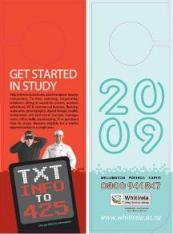
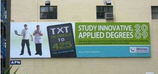
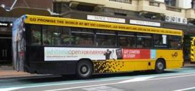

# Portfolio

Some companies we have helped with media planning:

* Amora Hotel Group (previously the Duxton)
* Whitireia Community Polytech
* Te Papa Museum of NZ
* The Cotton Store
* Banks Group of Companies
* Tricom Securities
* Arthritis Foundation
* ARP (NZ) Ltd - 4Jointz
* Royal NZ Foundation of the Blind
* Hospice NZ
* Organics Aotearoa
* 36 Bottles
* Film School NZ
* Electricity Efficiency Programme Electricity Commission
* Smart Payroll
* Creative NZ

We would also like to welcome <a href="http://www.lecordonbleu.co.nz">Le Cordon Bleu</a> to Adworx.

<h2>Whitireia Community Polytechnic:</h2>

The brief was to develop a media campaign to reach a notoriously difficult youth audience. Our options were further complicated by the need to concentrate on regional reach, against an active competitor, and at a time of year when most other industry players also actively recruit.

Working with an innovative and forward thinking client and in conjunction with NZ Bus we developed a new distribution channel as part of our approach.

**Concept**:

Promotional 
hangers for interiors of buses, targeting the student age commuters who use the 
bus service in and around Wellington.&nbsp; 

These hangers could be taken off the overhead hand rails or used to access the sms txt code to receive additional information on Whitiriea Semester 1 courses. Not only did the hangers elicit complimentary feedback from the public, it also proved to be a clean campaign for the bus company to run (no rubbish left in bus aisles).

To increase this reach we used billboard in a directional manner:

Plus regional TV with a call for response action through sms text message service.&nbsp; We also used bus 24’ exterior panels and small space interior side panels.

<h2>Royal NZ Foundation of the Blind</h2>

They 
say never work with Children or pets, but these puppies were just too divine not 
to use on a TV ad to raise awareness for the annual Royal NZ Foundation of the 
Blind - Red Puppy Appeal. 

We integrated this Appeal with online, adshels and print and raised a record 
sum for this charity client.

&nbsp;

&gt;&gt; <a href="puppy_appeal.html">View TV advertisement for RNZFB</a>

